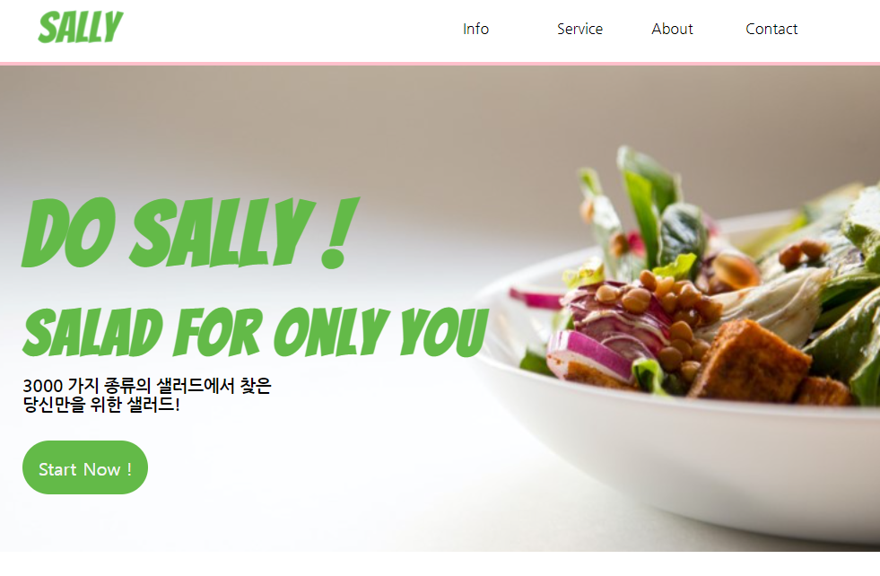
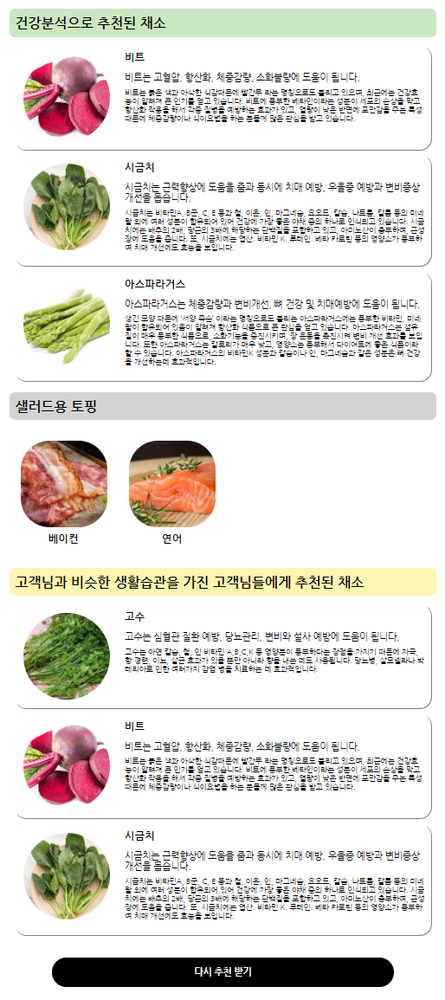
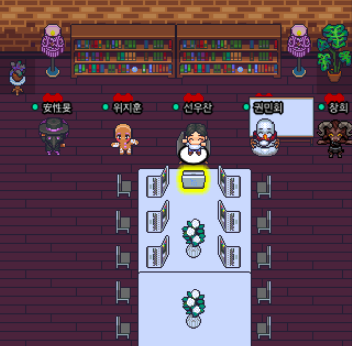

# Sally directory tree

```bash
code
├── res_vege
│   ├── res_vege3.py
│   ├── survey.csv
│   ├── toping2survey.csv
│   ├── vege2survey.csv
│   └── user2vege_score.csv
│   
└── sally_react
    ├── build : distribute sally
    │   └── static
    │       ├── css
    │       ├── js
    │       └── media : image data
    │
    ├── public : files for release
    │
    ├── server
    │   ├── config : connect to DB
    │   ├── migrations : connect to DB
    │   ├── models : connect to DB
    │   ├── seeders : default data
    │   ├── matrix_result.json : result data
    │   └── server.js : run server
    │
    ├── package.json : requirement package list
    ├── package-lock.json
    └── yarn.lock
```


# 개발환경

- Front-end : React, HTML, CSS
- Back-end : AWS, EC2, RDS, Node-express
- Reco sys : Python, scikit-learn


# Sally 소개

<p align="center">
	
</p>

<p align="center">
	
</p>

- 영양성분 기반으로 샐러드를 추천해주는 서비스입니다.
- 어떤 샐러드 채소를 먹을지, 어떤 토핑과 같이 먹을지, 채소 선택의 고민을 해소시켜 줍니다.


# 사용 예제

[Sally web page](http://sallysalad.shop) 링크입니다.

<p align="center">
	
</p>

- 샐리 홈페이지입니다.
- **Start Now** 버튼 or **Service** 버튼을 클릭하면 건강문진을 시작할 수 있습니다.

<p align="center">
	
</p>

- 기본 정보 / 특정 증상 불편 / 공통 증상 불편 / 생활습관 등의 건강문진을 거칩니다.

<p align="center">
	
</p>

- Sally는 세 가지 카테고리를 추천해줍니다.
  - 건강분석 기반의 샐러드 채소 추천
  - 건강분석 기반의 샐러드 토핑 추천
  - 비슷한 생활습관을 가진 유저들의 샐러드 채소 추천


# contributor

<p align="center">
	
</p>

<p align="center">
	
</p>
